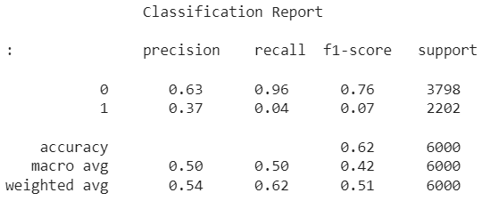
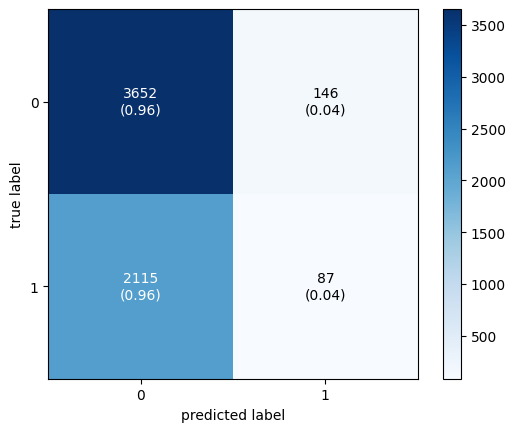
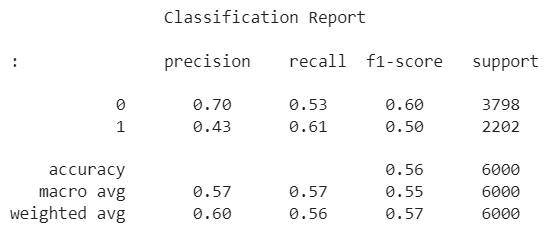
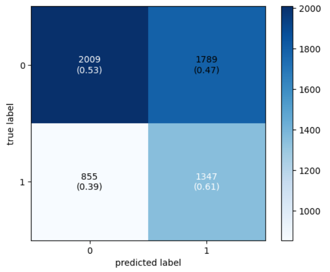
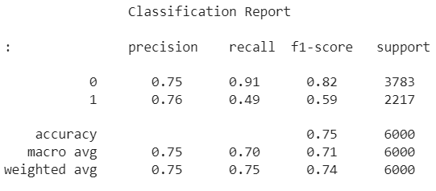
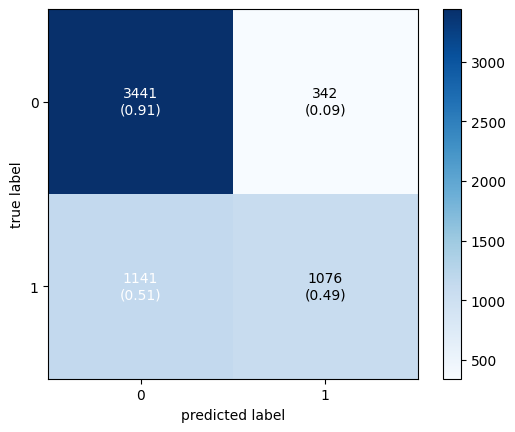
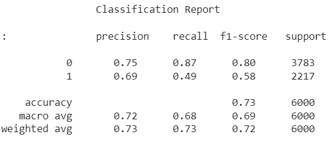
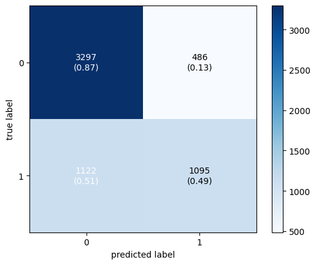

# Semantic-Similarity-on-Quora-Question-Pairs
The objective of this project is to determine whether two questions are similar. 
 The Quora Question Pairs dataset was used which is available on Kaggle. 
## Exploratory Data Analysis
1. There are a total of 404290 question pairs in the dataset
2. The dataset is unbalanced. There are more non-duplicate questions than duplicate questions
4. Number of unique questions = 537933 ; Number of questions getting repeated = 111780
## Preprocessing 
In this project out of 404290 question pairs, random 30000 samples were used.
  Out of this, there were 18951 non duplicate question pairs and 11049 duplicate question pairs
  The following preprocessing steps were used 
1. Questions were converted to lower case
2. Hashtags were removed
3. Special characters were removed
4. Links were removed
5. Non-Ascii characters were removed
6. Punctations were removed
7. Digits were removed
8. Single letters were removed
9. Multiple spaces were removed
 24000 training samples and 600 test samples were used. 
## Feature Extraction 
Two methods were used for feature extraction 
1. Bag of words (BoW) 
2. Term frequency inverse document frequency (TfIdf)
These were extracted uing sklean.feature_extraction.text.
## Model 
Two models were tested in this project 
1. Random Forest Model
2. XG Boost Model 
## Results
Since the data is imbalanced, F1 score metric and confusion matrix is used to evaluate the performance of the model 
### Random Forest + BoW

### XG Boost + BoW

### Random Forest + TfIdf

### XG Boost + TfIdf

## Discussion 
